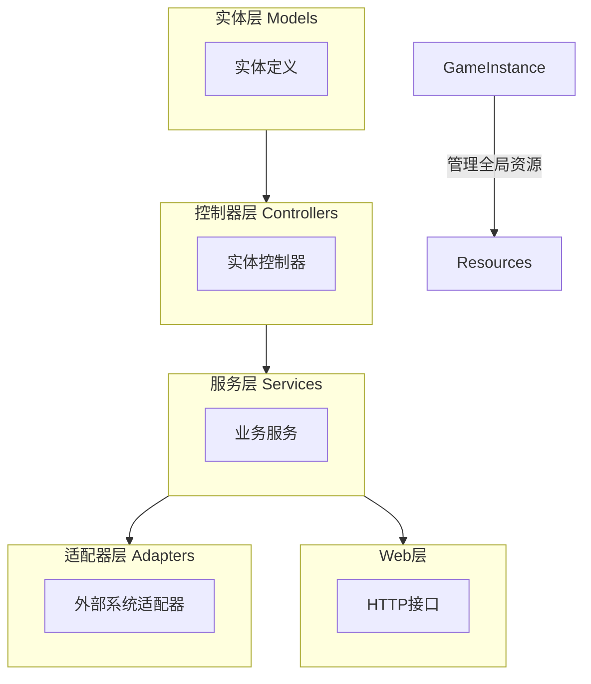
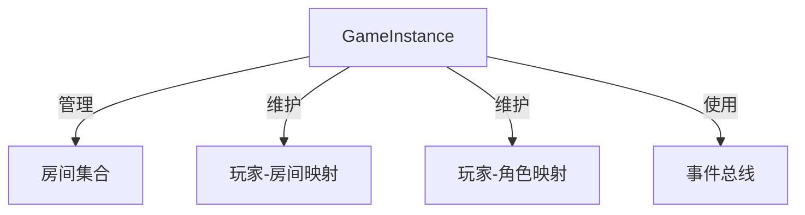
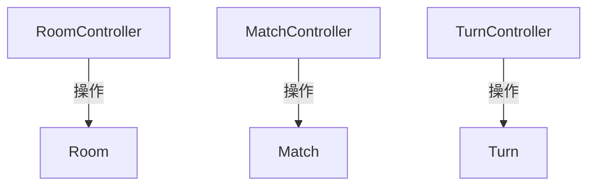
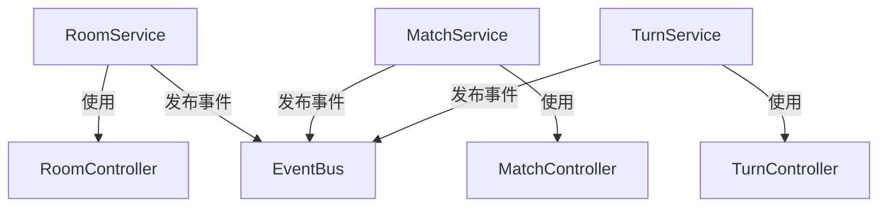

# 系统架构设计

## 整体架构概述

系统采用分层架构设计，主要分为以下几层：

1. **实体层（Models）**：定义系统中的核心数据结构
2. **控制器层（Controllers）**：处理实体的业务逻辑
3. **服务层（Services）**：协调多个控制器，处理跨实体业务逻辑和通知
4. **适配器层（Adapters）**：处理与外部系统的交互
5. **Web层**：提供HTTP接口

整体架构形成了一个清晰的层次结构，每一层都有明确的职责，使系统更加模块化和可维护。

## 层次职责划分

### 实体层（Models）

实体层定义了系统中的核心数据结构，包括：

- **Room**：房间实体
- **Match**：游戏局实体
- **Turn**：回合实体
- **Player**：玩家实体
- **Character**：角色实体

这些实体是系统的基础，它们不包含业务逻辑，只包含数据和简单的属性访问方法。

### 控制器层（Controllers）

控制器层负责处理实体的业务逻辑，包括：

- **RoomController**：处理房间相关的业务逻辑
- **MatchController**：处理游戏局相关的业务逻辑
- **TurnController**：处理回合相关的业务逻辑

控制器层直接操作实体，实现实体的业务逻辑，但不处理通知、事件分发等功能。

### 服务层（Services）

服务层负责协调多个控制器，处理跨实体业务逻辑和通知，包括：

- **RoomService**：协调房间相关的业务逻辑
- **MatchService**：协调游戏局相关的业务逻辑
- **TurnService**：协调回合相关的业务逻辑
- **NarrationService**：处理叙述生成
- **AIService**：处理AI相关功能

服务层调用控制器层的方法，并处理通知、事件分发等功能。

### 适配器层（Adapters）

适配器层负责处理与外部系统的交互，包括：

- **DingTalkAdapter**：处理与钉钉的交互
- **WebAdapter**：处理与Web前端的交互

适配器层将外部系统的请求转换为内部系统的调用，并将内部系统的响应转换为外部系统可以理解的格式。

### Web层

Web层提供HTTP接口，包括：

- **RoomRoutes**：提供房间相关的HTTP接口
- **GameRoutes**：提供游戏相关的HTTP接口
- **UserRoutes**：提供用户相关的HTTP接口

Web层调用服务层的方法，并将结果转换为HTTP响应。

## 主要组件及其关系

### GameInstance

GameInstance是系统的核心组件，它管理全局资源，包括房间、玩家映射等。它是一个单例对象，提供全局访问方法。

### 控制器与实体的关系

### 服务与控制器的关系

## 详细组件说明

### RoomController

RoomController负责处理房间相关的业务逻辑，包括：

- 创建房间
- 添加/移除玩家
- 设置玩家准备状态
- 踢出玩家
- 选择角色
- 设置剧本

### MatchController

MatchController负责处理游戏局相关的业务逻辑，包括：

- 创建游戏局
- 开始/暂停/恢复/结束游戏局
- 设置剧本
- 加载可选角色

### TurnController

TurnController负责处理回合相关的业务逻辑，包括：

- 创建新回合
- 完成当前回合
- 处理玩家行动
- 检查所有玩家是否已行动

### RoomService

RoomService负责协调房间相关的业务逻辑，包括：

- 创建房间
- 添加/移除玩家
- 设置玩家准备状态
- 踢出玩家
- 选择角色
- 设置剧本
- 通知玩家

### MatchService

MatchService负责协调游戏局相关的业务逻辑，包括：

- 创建游戏局
- 开始/暂停/恢复/结束游戏局
- 设置剧本
- 加载可选角色
- 通知玩家

### TurnService

TurnService负责协调回合相关的业务逻辑，包括：

- 转换到DM回合
- 转换到玩家回合
- 处理玩家行动
- 处理骰子结果
- 通知回合开始/结束
- 处理回合转换

## 事件系统

系统使用事件总线（EventBus）来处理事件分发，主要事件包括：

- **PlayerJoinedEvent**：玩家加入事件
- **PlayerLeftEvent**：玩家离开事件
- **PlayerActionEvent**：玩家行动事件
- **DMNarrationEvent**：DM叙述事件

服务层发布事件，适配器层订阅事件并处理。

## 命令系统

系统使用命令模式来处理用户输入，主要命令包括：

- **RoomCommands**：房间相关命令
- **PlayerCommands**：玩家相关命令
- **GameCommands**：游戏相关命令

命令由适配器层接收，然后转发给服务层处理。

## 总结

系统采用分层架构设计，每一层都有明确的职责，使系统更加模块化和可维护。通过控制器层和服务层的分离，使业务逻辑更加清晰，同时也使系统更加灵活，便于扩展和维护。
