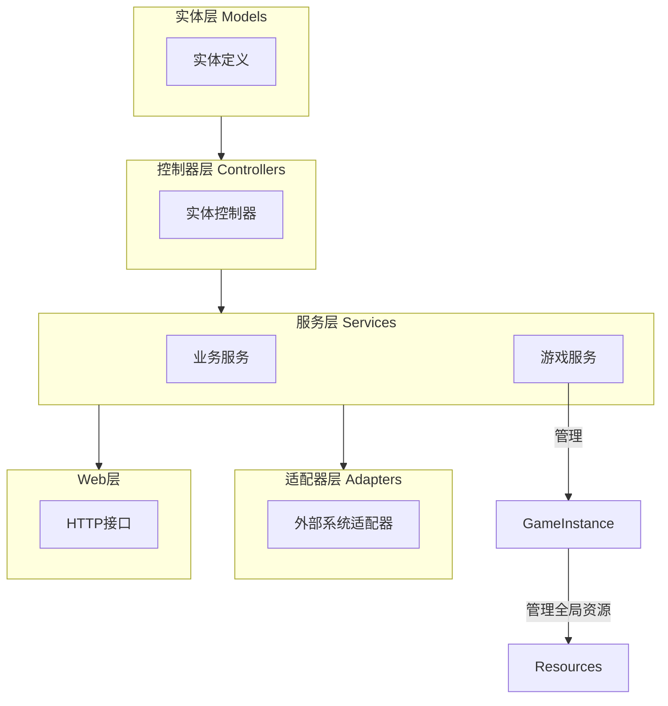
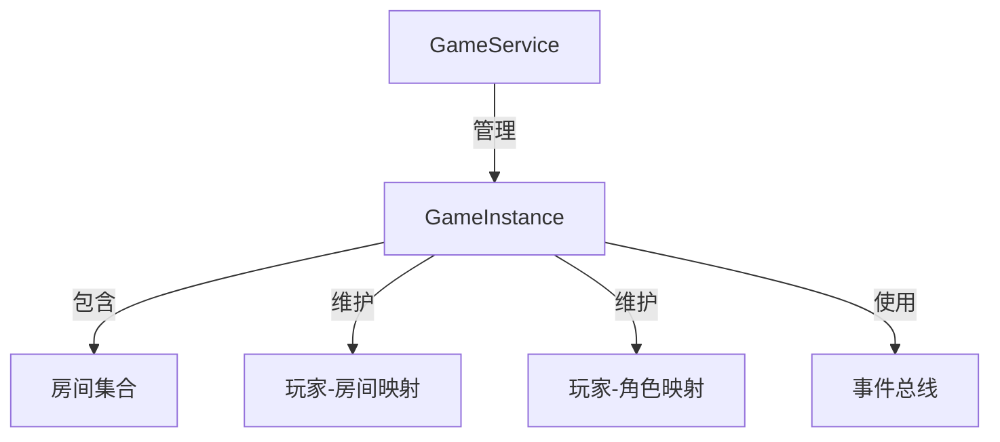
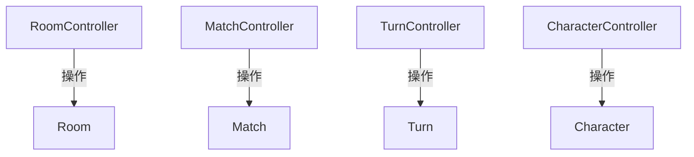
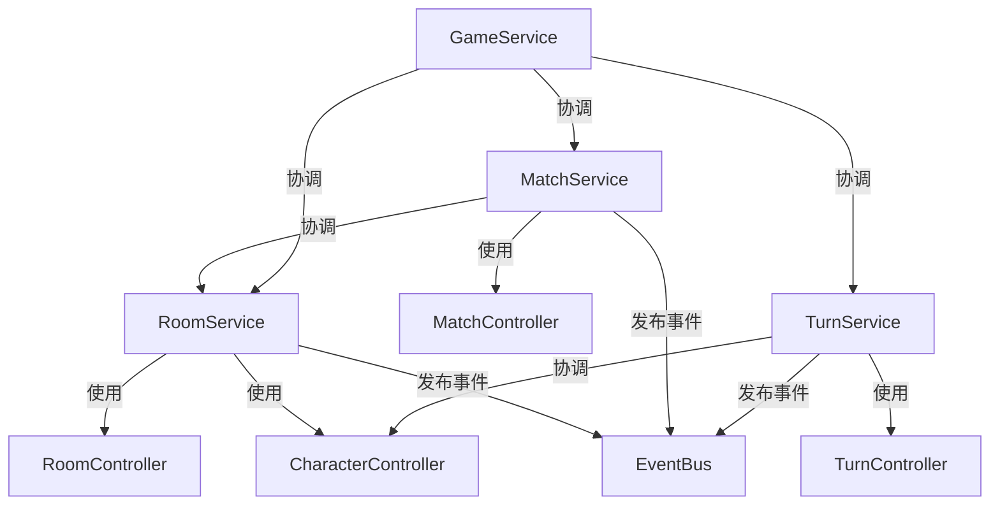
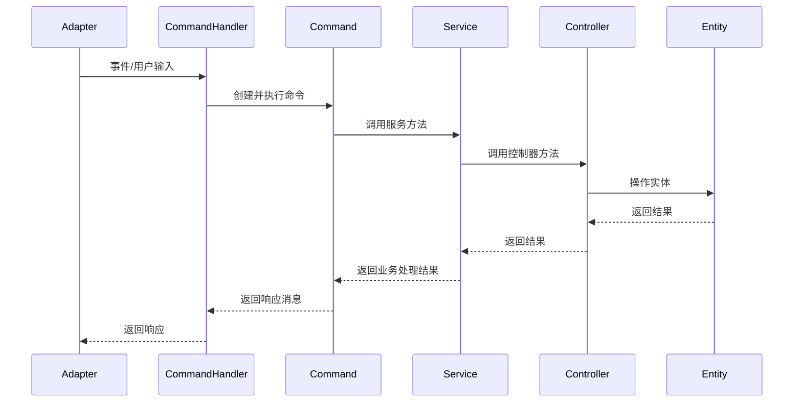
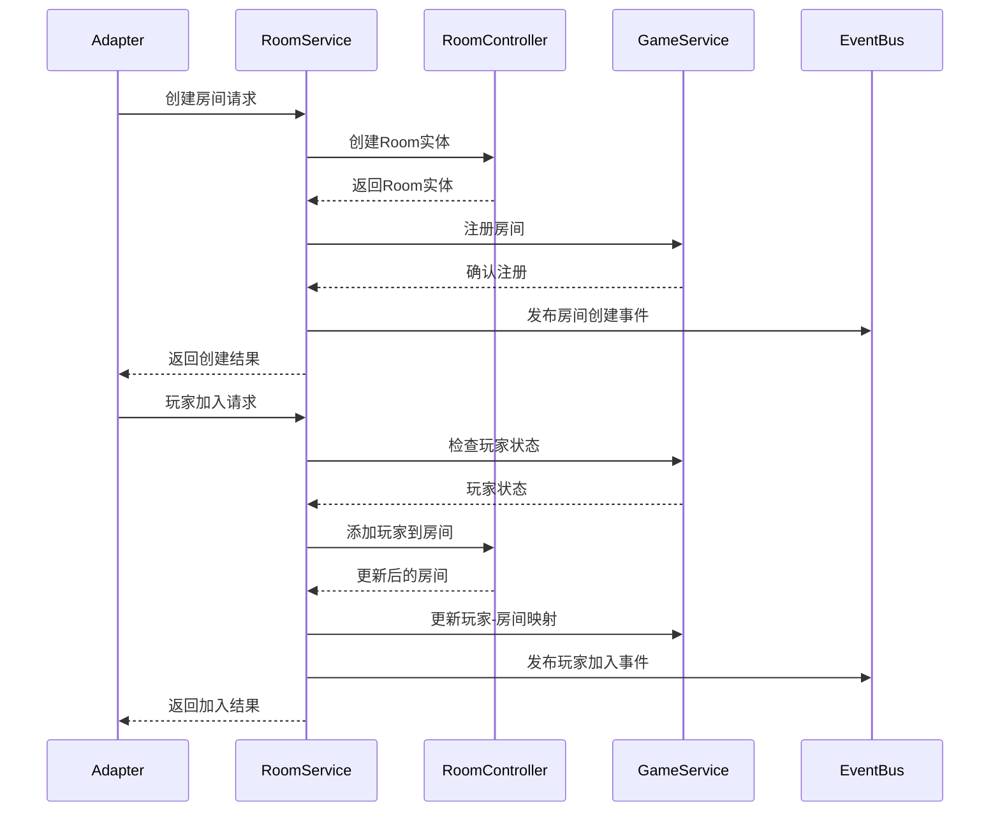
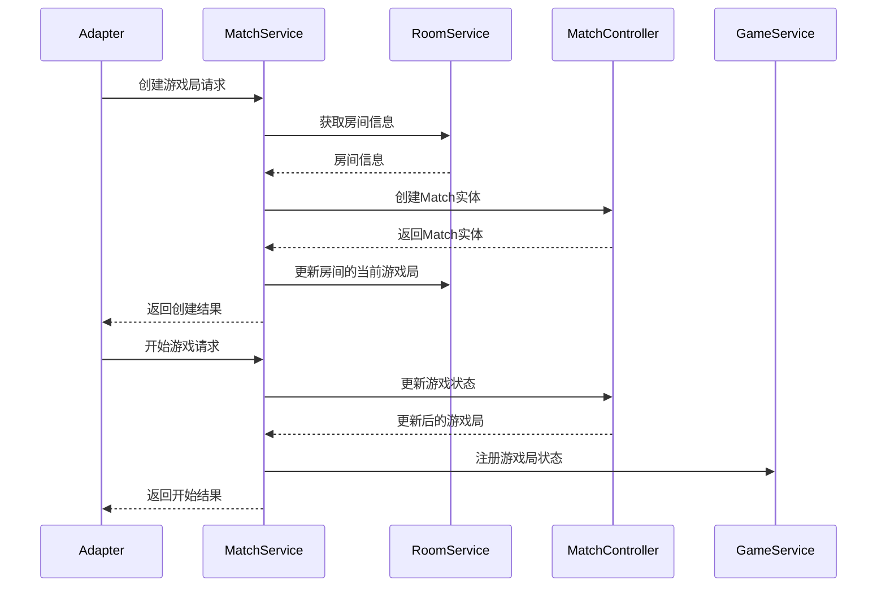

# 系统架构设计

## 整体架构概述

系统采用分层架构设计，主要分为以下几层：

1. **实体层（Models）**：定义系统中的核心数据结构
2. **控制器层（Controllers）**：处理单个实体的状态管理和基本操作
3. **服务层（Services）**：协调多个控制器，处理跨实体业务逻辑和通知
4. **适配器层（Adapters）**：处理与外部系统的交互
5. **Web层**：提供HTTP接口

整体架构形成了一个清晰的层次结构，每一层都有明确的职责，使系统更加模块化和可维护。

## 层次职责划分

### 实体层（Models）

实体层定义了系统中的核心数据结构，包括：

- **Room**：房间实体
- **Match**：游戏局实体
- **Turn**：回合实体
- **Player**：玩家实体
- **Character**：角色实体

这些实体是系统的基础，它们不包含业务逻辑，只包含数据和简单的属性访问方法。

### 控制器层（Controllers）

控制器层负责处理单个实体的状态管理和基本操作，每个控制器仅操作特定的实体类型：

- **RoomController**：仅负责Room实体的状态管理
- **MatchController**：仅负责Match实体的状态管理
- **TurnController**：仅负责Turn实体的状态管理
- **CharacterController**：仅负责Character实体的状态管理

控制器层不处理跨实体的业务逻辑，不处理通知、事件分发和全局状态同步等功能。控制器方法应该是纯粹的操作，不依赖外部系统。

### 服务层（Services）

服务层负责协调多个控制器，处理跨实体业务逻辑、全局状态同步和通知等功能：

- **RoomService**：协调房间相关的业务逻辑，管理房间与玩家的关系
- **MatchService**：协调游戏局相关的业务逻辑，管理游戏局与房间的关系
- **TurnService**：协调回合相关的业务逻辑，管理回合转换和玩家行动
- **GameService**：管理全局游戏状态，协调各服务之间的关系
- **NarrationService**：处理叙述生成
- **AIService**：处理AI相关功能

服务层负责跨实体的业务流程，处理通知、事件分发等功能。同时，服务层也负责维护全局状态的一致性。

### 适配器层（Adapters）

适配器层负责处理与外部系统的交互，包括：

- **DingTalkAdapter**：处理与钉钉的交互
- **WebAdapter**：处理与Web前端的交互

适配器层将外部系统的请求转换为内部系统的调用，并将内部系统的响应转换为外部系统可以理解的格式。

### Web层

Web层提供HTTP接口，包括：

- **RoomRoutes**：提供房间相关的HTTP接口
- **GameRoutes**：提供游戏相关的HTTP接口
- **UserRoutes**：提供用户相关的HTTP接口

Web层调用服务层的方法，并将结果转换为HTTP响应。

## 主要组件及其关系

### GameInstance与GameService

GameInstance是系统的数据中心，管理全局资源，包括房间、玩家映射等。GameService是对GameInstance的业务封装，提供管理全局资源的方法。

### 控制器与实体的关系

控制器层中的每个控制器只负责单一类型的实体操作：

### 服务与控制器的关系

服务层协调多个控制器来实现复杂的业务逻辑：

## 详细组件设计

### RoomController

RoomController仅负责Room实体的基本操作，包括：

- 添加/移除玩家到房间实体
- 设置玩家准备状态
- 获取房间内的玩家列表
- 获取/设置房主

RoomController不再处理跨实体操作，如创建游戏局、选择角色等。

### MatchController

MatchController仅负责Match实体的基本操作，包括：

- 创建/获取游戏局
- 开始/暂停/恢复/结束游戏局
- 设置游戏局属性（如剧本）
- 管理游戏局状态

MatchController不再直接依赖于Room，它通过ID引用或参数传递获取必要信息。

### TurnController

TurnController仅负责Turn实体的基本操作，包括：

- 创建新回合
- 完成当前回合
- 记录玩家行动
- 获取回合状态

TurnController不再直接操作Character等其他实体，这些跨实体操作由服务层负责。

### CharacterController

新增的CharacterController负责Character实体的基本操作，包括：

- 创建/获取角色
- 修改角色属性（如生命值）
- 处理角色状态

### RoomService

RoomService协调Room相关的业务逻辑，包括：

- 创建房间
- 管理玩家加入/离开房间
- 处理房主变更
- 协调房间与角色的关系
- 发送房间相关的通知

### MatchService

MatchService协调Match相关的业务逻辑，包括：

- 为房间创建游戏局
- 管理游戏局的生命周期
- 协调Match与Room的关系
- 发送游戏局相关的通知

### TurnService

TurnService协调Turn相关的业务逻辑，包括：

- 管理回合转换
- 处理玩家行动及其影响
- 应用游戏规则
- 发送回合相关的通知

### GameService

GameService管理全局游戏状态，包括：

- 维护全局映射（玩家-房间，玩家-角色）
- 协调各服务之间的关系
- 处理跨服务的业务流程

## 事件系统

系统使用事件总线（EventBus）来处理事件分发，主要事件包括：

- **PlayerJoinedEvent**：玩家加入事件
- **PlayerLeftEvent**：玩家离开事件
- **PlayerActionEvent**：玩家行动事件
- **DMNarrationEvent**：DM叙述事件

服务层发布事件，适配器层订阅事件并处理。

## 命令系统

系统使用命令模式来处理用户输入，主要由以下部分组成：

### 命令基类及实现

- **GameCommand**：所有命令的基类，定义了命令的基本接口和通用功能
- **服务特定命令**：针对不同业务场景的具体命令实现

### 命令与分层架构的关系

命令系统作为适配器层与服务层之间的桥梁，遵循以下原则：

1. **命令通过服务提供者获取服务**：命令不直接访问GameInstance或其他全局状态，而是通过ServiceProvider获取需要的服务
2. **命令委托服务处理业务逻辑**：命令不包含复杂业务逻辑，而是将请求委托给相应的服务处理
3. **服务协调多个控制器**：服务层负责协调多个控制器来完成跨实体的操作
4. **控制器处理单一实体操作**：控制器仅负责单一类型实体的基本操作

### 命令处理流程

### 命令工厂

系统使用命令工厂来创建命令实例，基于事件类型选择合适的命令：

- **CommandFactory**：负责根据事件类型创建对应的命令实例
- **ServiceProvider**：为命令提供所需的服务实例

命令工厂确保命令与适配器层的松耦合，使系统更容易扩展和测试。

## 重构后的工作流程示例

以下是一个重构后的工作流程示例，展示了各层之间的交互：

### 创建房间并加入玩家

### 创建游戏局并开始游戏

## 总结

重构后的架构明确了各层的职责和边界，特别是将控制器限制在单个实体的操作范围内，而将跨实体的业务逻辑和协调工作交由服务层处理。这样的设计使系统更加模块化和可维护，同时也为未来的扩展提供了更好的基础。

此外，新增的GameService和CharacterController填补了原架构中的缺口，使得全局状态管理和角色操作更加清晰和专注。事件系统和命令系统也更好地与分层架构整合，使得系统的各部分之间的交互更加清晰和可控。
