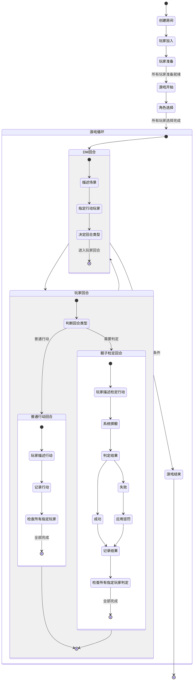

# 游戏玩法流程

## 游戏概述
这是一个文字跑团游戏，玩家通过扮演角色，在AI扮演的DM（主持人）引导下进行角色扮演和故事探索。游戏围绕剧本展开，通过玩家的选择和行动推进情节发展。

## 核心流程

### 1. 房间准备阶段
1. **创建房间**：玩家创建新房间，成为房主
2. **选择剧本**：房主从可用剧本中选择一个作为本次游戏的故事背景
3. **玩家加入**：其他玩家加入已创建的房间
4. **准备状态**：所有玩家选择"准备"状态
5. **开始游戏**：所有玩家准备就绪后，房主启动游戏

### 2. 角色选择阶段
1. **角色选择**：游戏开始后，每位玩家从剧本提供的角色中选择一个进行扮演
2. **选择完成**：所有玩家确认角色选择后，进入正式游戏阶段

### 3. 游戏执行阶段

游戏执行阶段由DM回合和玩家回合交替进行：

#### DM回合
1. **场景描述**：AI-DM描述当前场景和情况
2. **指定玩家**：AI-DM指定哪些玩家可以在下一回合行动
3. **回合转换**：AI-DM决定下一回合是普通行动回合还是骰子检定回合

#### 玩家回合
玩家回合分为两种类型：

##### 普通行动回合
1. **玩家行动**：被指定的玩家描述自己的行动
2. **行动记录**：系统记录玩家行动
3. **回合完成**：所有被指定的玩家都完成行动后，回合结束，进入下一个DM回合

##### 骰子检定回合
1. **行动描述**：被指定的玩家描述自己打算如何行动
2. **掷骰判定**：系统为玩家投掷骰子，根据难度判定成功或失败
3. **结果应用**：
   - 成功：玩家行动成功
   - 失败：玩家行动失败，可能导致角色受到伤害
4. **回合完成**：所有被指定的玩家都完成判定后，回合结束，进入下一个DM回合

### 4. 游戏结束
1. **结局条件**：剧本预设成功或失败条件
2. **游戏终止**：达成任一结局条件时，游戏结束

## 状态转换流程图

## 系统角色

- **房主**：创建房间、选择剧本、启动游戏
- **普通玩家**：加入房间、选择角色、执行行动
- **AI-DM（AI主持人）**：由AI扮演，负责描述场景、推进剧情、判断结果、指定行动玩家

## 回合与行动规则

1. **回合交替**：DM回合和玩家回合交替进行
2. **行动指定**：每个玩家回合中，只有被AI-DM指定的玩家才能行动
3. **回合结束条件**：所有被指定的玩家都完成行动/判定后，当前回合才会结束
4. **判定规则**：在骰子检定回合中，系统会根据难度和骰子结果判定成功或失败
5. **失败惩罚**：判定失败可能导致角色受到伤害，生命值减少

## 执行逻辑关系

1. **房间与玩家**：一个房间可以容纳多个玩家，每个玩家同一时间只能在一个房间中
2. **房间与游戏**：一个房间同一时间只能进行一个游戏
3. **玩家与角色**：一个玩家在一局游戏中只能扮演一个角色
4. **剧本与结局**：每个剧本都有预设的成功和失败条件
5. **AI与剧本**：AI根据选定的剧本生成叙述内容和指导游戏流程
